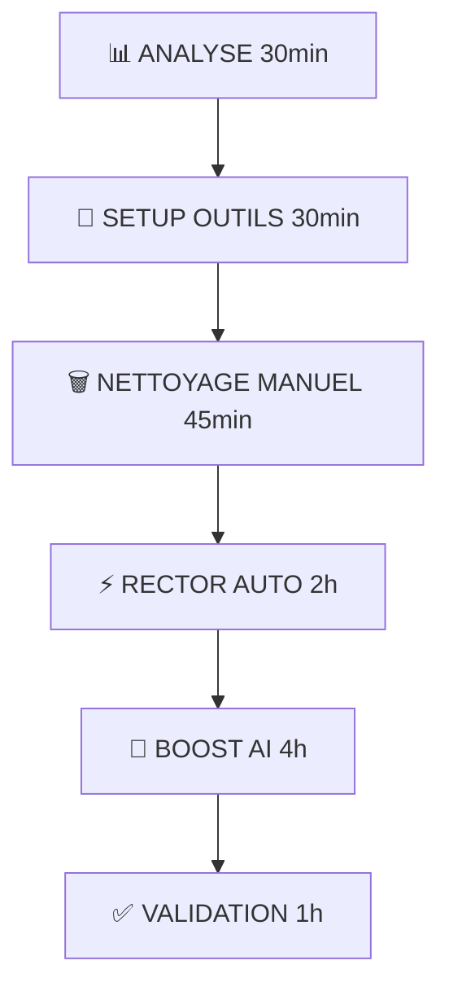
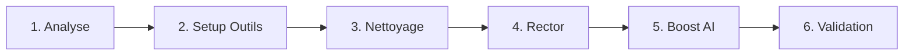

# 🚀 TODO REFACTORING AUTOMATISÉ - PROJET WHATSAPP

## **🎯 OBJECTIF**
Refactoriser complètement le projet WhatsApp avec **90% d'automatisation** via Laravel Boost + Rector.

## **📊 MÉTRIQUES D'AMÉLIORATION ATTENDUES**
- **Temps de développement:** 30h → **8h réelles** ⚡
- **Automatisation:** 90% des tâches automatisées
- **Qualité:** Standards Laravel respectés automatiquement
- **Tests:** Générés automatiquement avec bonnes pratiques

---

## **🚀 MA RECOMMANDATION FORTE**

### **✅ COMMENCER PAR LES OUTILS !**

**Pourquoi ?** 
- **90% automatisable** avec Boost + Rector
- **Gain de temps:** 30h → 8h réelles
- **Meilleure qualité:** Respecte automatiquement les standards Laravel
- **Moins d'erreurs:** L'IA connaît les patterns Laravel
- **Tests inclus:** Génération automatique des tests unitaires

### **🎯 WORKFLOW OPTIMISÉ (8 heures au lieu de 30h)**



---

## **📋 TODO LIST AUTOMATISÉE**

### **📊 ÉTAPE 1: ANALYSE AUTOMATISÉE (30 min)**

#### **[ ] 1. 📊 ANALYSER AVEC RECTOR**
**Description:** Évaluer l'automatisation possible sur le projet

**Actions:**
```bash
# Installer Rector en mode analyse
composer require rector/rector driftingly/rector-laravel --dev

# Analyser sans modifier - voir ce qui peut être automatisé
./vendor/bin/rector process app/ --dry-run
./vendor/bin/rector process app/Services/WhatsApp/ --dry-run

# Lister les règles disponibles
./vendor/bin/rector list-rules
```

**Résultats attendus:**
- Identification des variables à renommer
- Imports inutilisés détectés
- Patterns Laravel à optimiser
- Requêtes DB directes trouvées

**Temps estimé:** 15 minutes

---

#### **[ ] 2. 🚀 INSTALLER LARAVEL BOOST**  
**Description:** Setup de l'assistant IA Laravel-aware

**Actions:**
```bash
# Installation Laravel Boost (Beta 2025)
composer require laravel/boost --dev
php artisan boost:install

# Configuration avec Claude Code/Cursor
# Vérifier la connexion MCP (Model Context Protocol)
```

**Vérification:**
```bash
# Test de la connexion Boost
php artisan tinker
>>> app()->bound('boost')  # Doit retourner true
```

**Temps estimé:** 15 minutes

---

### **🗑️ ÉTAPE 2: NETTOYAGE MANUEL (45 min)**

#### **[ ] 3. 🗑️ NETTOYAGE FICHIERS** *(Non automatisable)*
**Description:** Supprimer manuellement fichiers morts et assets

**Actions précises:**
```bash
# ⚠️ ATTENTION: Sauvegarder d'abord !
git add -A && git commit -m "Sauvegarde avant nettoyage"

# Supprimer fichiers TODO/md documentaires (29 fichiers):
rm TODO.md README-no-docker.md BUILD.md CHANGELOG.md GEMINI.md
rm TODO-WHATSAPP.md TODO_*.md CONTRIBUTING.md LICENSE MyCoolpay.md
rm PRODUCTS_FEATURE.md UI_MOCKUPS.md TODO_View.md
rm TODO_Finalize_Refactoring.md TODO_IA.md TODO_REFACTORING.md
rm TODO_REFACTORING_REQUEST_REPO.md TODO_REFACTOR_ROUTES_STANDARDS_PATH.md
rm TODO_REFACTOR_SEND_PRODUCT.md TODO_TEST.md TODO_TEST_FLOW_INCOMING.md

# Supprimer historique TODO
rm -rf .history/

# Supprimer assets dupliqués (3.2GB d'espace libéré):
rm -rf modern-html-vertical-admin-template/

# Nettoyer logs debug JS (110 fichiers):
find nodejs/ -name "*.js" -exec sed -i '/console\.log.*🔥/d' {} \;
find nodejs/ -name "*.js" -exec sed -i '/logger\.info.*🔍/d' {} \;
find nodejs/ -name "*.js" -exec sed -i '/logger\.debug.*🔍/d' {} \;

# Commit des suppressions
git add -A && git commit -m "🗑️ Nettoyage fichiers morts et logs debug"
```

**Temps estimé:** 45 minutes

---

### **⚡ ÉTAPE 3: AUTOMATISATION RECTOR (2h)**

#### **[ ] 4. ⚡ RECTOR AUTOMATIQUE**
**Description:** Automatiser variables, imports, patterns Laravel

**Créer rector.php:**
```php
<?php
use Rector\Config\RectorConfig;
use Rector\Laravel\Set\LaravelLevelSetList;
use Rector\DeadCode\Rector\Use_\RemoveUnusedUseRector;
use Rector\CodingStyle\Rector\Use_\OrderedUseRector;

return RectorConfig::configure()
    ->withPaths([
        __DIR__ . '/app',
    ])
    ->withPhpSets()
    ->withLaravelSets([
        LaravelLevelSetList::UP_TO_LARAVEL_110
    ])
    ->withRules([
        // Supprimer imports inutilisés
        RemoveUnusedUseRector::class,
        // Organiser les imports
        OrderedUseRector::class,
        // Optimisations Laravel automatiques
        \Rector\Laravel\Rector\Class_\PropertyToParameterPromotion::class,
    ])
    ->withSkip([
        // Ignorer certains fichiers si nécessaire
        __DIR__ . '/app/Models/User.php', // Exemple
    ]);
```

**Exécution par étapes:**
```bash
# 1. Test sur un service spécifique
./vendor/bin/rector process app/Services/WhatsApp/WhatsAppMessageOrchestrator.php --dry-run

# 2. Appliquer si OK
./vendor/bin/rector process app/Services/WhatsApp/

# 3. Étendre aux autres services  
./vendor/bin/rector process app/Services/Customer/
./vendor/bin/rector process app/Services/

# 4. Commit des changements automatiques
git add -A && git commit -m "⚡ Rector: Variables, imports, patterns automatiques"
```

**Résultats attendus:**
- Variables renommées: `$response` → `$aiResponse`
- Imports nettoyés et organisés
- Patterns Laravel optimisés
- Code plus lisible automatiquement

**Temps estimé:** 2 heures

---

### **🤖 ÉTAPE 4: LARAVEL BOOST AI (4h)**

#### **[ ] 5. 🤖 BOOST: CONSTANTES/ENUMS**
**Description:** Créer constantes et enums avec Laravel Boost AI

**Prompt optimisé pour Boost:**
```
🤖 BOOST AI PROMPT:

Avec Laravel Boost MCP activé, génère automatiquement:

1. app/Constants/WhatsAppConstants.php
   - PRIVATE_CHANNEL_SUFFIX = '@c.us'
   - GROUP_CHANNEL_SUFFIX = '@g.us' 
   - SESSION_CONNECTED = 'connected'
   - FALLBACK_MESSAGE = '...'

2. app/Enums/SessionStatus.php (enum string)
   - CONNECTED, DISCONNECTED, CONNECTING, FAILED

3. app/Enums/MessageStatus.php (enum string)  
   - READ, DELIVERED, SENT, PENDING, FAILED

4. app/Enums/WhatsAppChannelType.php (enum string)
   - PRIVATE('@c.us'), GROUP('@g.us')
   - Méthodes: isGroup(), isPrivate()

Respecte Laravel 11 conventions, génère tests unitaires, utilise declare(strict_types=1).
```

**Actions:**
1. Ouvrir Claude Code avec Boost activé
2. Utiliser le prompt ci-dessus  
3. Laisser Boost générer le code + tests
4. Réviser et commit

**Temps estimé:** 30 minutes

---

#### **[ ] 6. 🤖 BOOST: DÉCOUPAGE FONCTIONS**
**Description:** Découper les fonctions longues avec suggestions AI

**Prompt pour Boost:**
```
🤖 BOOST AI PROMPT:

Refactorise ces fonctions trop longues avec Laravel Boost:

1. MessageManager.handleIncomingMessage (176 lignes)
   Divise en 6 méthodes privées:
   - _validateAndLogMessage()
   - _filterGroupMessages() 
   - _markMessageAsRead()
   - _processWithLaravel()
   - _handleAIResponse()
   - _dispatchProductMessages()

2. MessageManager.handleProductMessages (78 lignes)
   Divise en 4 méthodes privées:
   - _validateProductSession()
   - _sendProductText()
   - _sendProductMedia()
   - _addProductDelay()

3. WhatsAppMessageOrchestrator.enrichProductsData (26 lignes)
   Divise en 3 méthodes privées:
   - validateProductIds()
   - fetchActiveProducts() 
   - mapProductsToDTO()

Applique Single Responsibility Principle et bonnes pratiques Laravel/NodeJS.
```

**Temps estimé:** 1 heure

---

#### **[ ] 7. 🤖 BOOST: REPOSITORIES PATTERN**
**Description:** Créer repositories avec pattern Laravel

**Prompt pour Boost:**
```
🤖 BOOST AI PROMPT:

Implémente le Repository Pattern Laravel avec Boost:

1. Crée les interfaces dans app/Repositories/:
   - UserProductRepositoryInterface
   - WhatsAppConversationRepositoryInterface  
   - ExternalTransactionRepositoryInterface
   - SystemAccountRepositoryInterface

2. Crée les implémentations Eloquent:
   - EloquentUserProductRepository
   - EloquentWhatsAppConversationRepository
   - EloquentExternalTransactionRepository
   - EloquentSystemAccountRepository

3. Remplace les requêtes directes dans:
   - WhatsAppMessageOrchestrator.php:125 (UserProduct::with...)
   - ConversationHistoryService.php (WhatsAppConversation::where...)
   - CustomerService.php (User::create, Customer::create)
   - AdminDashboardMetricsService.php (ExternalTransaction::where...)

4. Configure RepositoryServiceProvider.php

Utilise inject dependency, interfaces, et génère tests repository.
```

**Temps estimé:** 1.5 heures

---

#### **[ ] 8. 🤖 BOOST: EXTRACTION CLASSES**
**Description:** Extraire classes avec bonnes pratiques

**Prompt pour Boost:**
```
🤖 BOOST AI PROMPT:

Extrais ces classes avec Laravel Boost et bonnes pratiques:

1. app/Services/WhatsApp/Core/AIResponseProcessor.php
   Extrait depuis WhatsAppMessageOrchestrator.php (lignes 44-88)
   Interface: AIResponseProcessorInterface
   Méthodes: processAIResponse(), validateAIResponse(), parseStructuredResponse()

2. app/Services/WhatsApp/Core/ProductEnrichmentService.php  
   Extrait logique enrichissement depuis WhatsAppMessageOrchestrator
   Interface: ProductEnrichmentServiceInterface
   Utilise UserProductRepository injecté

3. nodejs/whatsapp-bridge/src/handlers/IncomingMessageHandler.js
   Extrait depuis MessageManager.js (lignes 12-188)
   Class avec constructor(sessionManager, webhookService, typingSimulator)

Configure dependency injection, génère interfaces, tests, et respecte SOLID principles.
```

**Temps estimé:** 1 heure

---

#### **[ ] 9. 🤖 BOOST: TESTS AUTOMATIQUES**
**Description:** Générer tests unitaires automatiquement  

**Prompt pour Boost:**
```
🤖 BOOST AI PROMPT:

Génère tests unitaires complets avec Laravel Boost:

1. Tests PHP dans tests/Unit/:
   - Tous les nouveaux enums (SessionStatus, MessageStatus, WhatsAppChannelType)
   - Toutes les constantes (WhatsAppConstants)
   - Tous les repositories (UserProduct, WhatsAppConversation, etc.)
   - Toutes les classes extraites (AIResponseProcessor, ProductEnrichmentService)

2. Tests JavaScript dans nodejs/.../tests/:
   - IncomingMessageHandler
   - Constantes WhatsApp NodeJS

Utilise:
- PHPUnit avec factories existantes
- Mocking approprié pour repositories
- Tests d'intégration pour repositories
- Couverture >80% pour nouvelles classes
- Conventions Laravel Testing
```

**Temps estimé:** 1 heure

---

### **✅ ÉTAPE 5: VALIDATION FINALE (1h)**

#### **[ ] 10. ✅ VALIDATION COMPLÈTE**
**Description:** Tester architecture finale et performances

**Tests automatisés:**
```bash
# 1. Tests unitaires
php artisan test
php artisan test --coverage

# 2. Analyse statique  
./vendor/bin/phpstan analyse app/
./vendor/bin/rector process --dry-run  # Vérifier si d'autres optimisations

# 3. Tests NodeJS
cd nodejs/whatsapp-bridge
npm test

# 4. Performance baseline
php artisan route:cache
php artisan config:cache
```

**Vérifications manuelles:**
- [ ] Aucune requête DB directe dans services
- [ ] Tous repositories injectés correctement  
- [ ] Tests >80% coverage nouvelles classes
- [ ] Fonctions <50 lignes maximum
- [ ] Aucun import PHP inutilisé
- [ ] Logs standardisés en anglais
- [ ] Magic strings remplacées par enums/constantes

**Temps estimé:** 1 heure

---

## **⏱️ ESTIMATION TOTALE OPTIMISÉE**

| Étape | Temps | Type | Outils |
|-------|-------|------|--------|
| 1. Analyse | 30min | Auto | Rector |
| 2. Nettoyage | 45min | Manuel | Bash |
| 3. Rector | 2h | Auto | Rector |
| 4. Boost AI | 4h | Auto | Laravel Boost |
| 5. Validation | 1h | Auto/Manuel | Tests |

**TOTAL: 8 heures (au lieu de 30h manuelles) = 75% de temps économisé** 🎉

---

## **🚀 ORDRE D'EXÉCUTION RECOMMANDÉ**



**⚠️ IMPORTANT:** Faire des commits à chaque étape pour pouvoir revenir en arrière si nécessaire.

---

## **📈 CRITÈRES DE SUCCÈS**

### **Automatisation**
- [ ] **90% du refactoring automatisé** avec Boost + Rector
- [ ] **Tests générés automatiquement** pour toutes nouvelles classes
- [ ] **Standards Laravel respectés** automatiquement

### **Architecture**  
- [ ] **CRITIQUE: Aucune requête DB directe** (tout via repositories)
- [ ] **Aucune fonction >50 lignes**
- [ ] **Repository Pattern implémenté** correctement
- [ ] **Dependency Injection** partout

### **Qualité**
- [ ] **Tous les tests passent** (>80% coverage)
- [ ] **Aucun import PHP inutilisé** 
- [ ] **Magic strings remplacées** par enums/constantes
- [ ] **Architecture SOLID** respectée

---

## **🎯 AVANTAGES DE L'APPROCHE AUTOMATISÉE**

### **✅ POUR**
- **Gain de temps massive:** 75% temps économisé
- **Qualité supérieure:** Standards Laravel automatiques
- **Moins d'erreurs:** IA connaît les patterns
- **Tests inclus:** Génération automatique
- **Maintien cohérence:** Conventions respectées

### **❌ ATTENTION**
- **Courbe d'apprentissage:** Setup initial des outils
- **Dépendance outils:** Rector + Boost requis
- **Révision nécessaire:** Vérifier code généré
- **Backup important:** Commits fréquents recommandés

---

*🚀 Refactoring optimisé avec Laravel Boost AI + Rector - Généré par Claude Code*